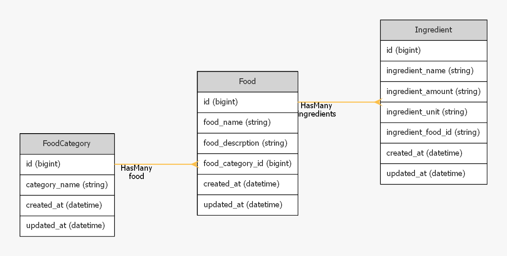

# Simple Receipt CRUD Application
This is a simple CRUD application for managing receipts and their ingredients. The application is designed to store data in a MySQL database and provides an easy-to-use user interface for creating, reading, updating, and deleting receipts and ingredients.

## Table Structure
The application has three tables:
1. FoodCategory - This table contains the categories of receipts. The table has the following columns:
   - id - The unique identifier of the category.
   - food_category_name - The name of the category.
2. Food - This table contains the Dish. The table has the following columns:
   - id - The unique identifier of the dish.
   - food_name - The name of the dish.
   - food_description - The description of the dish.
   - food_category_id - The foreign key to the Category table.
3. Ingredient - This table contains the ingredients of the dishs. The table has the following columns:
   - id - The unique identifier of the ingredient.
   - ingredient_name - The name of the ingredient.
   - ingredient_amount - The amout of the ingredient.
   - ingredient_unit - The unit of the ingredient.
   - ingredient_food_id - The foreign key to the Food table.


   
## Functionality
The application provides the following functionality:

- View all categories, receipts, and ingredients in separate pages.
- Create new categories, receipts, and ingredients.
- Edit existing categories, receipts, and ingredients.
- Delete existing categories, receipts, and ingredients.

## Requirements 
To run the application, you need to have the following:
- PHP version 8.1 or later.
- MySQL database.
- Web server like Apache or Nginx.

## Installation
To install the application, follow these steps:
1. Clone the repository or download the source code.
2. Create a new MySQL database.
3. Copy the .env file `cp .env.example .env`
4. Configure the database connection by editing the .env file in the root directory of the application.
5. Run : 
   ```
   composer install
   ```
   and then run :
   ```
   php artisan migrate
   ```
6. Then run :
    ```
   php artisan serve
   ```
7. To test, run :
    ```
    php artisan test
    ```
## Conclusion
This is a simple and easy-to-use CRUD application for managing receipts and their ingredients. It provides all the basic functionality you need to store, edit, and delete your receipts and ingredients. Feel free to customize and extend it to fit your needs.
